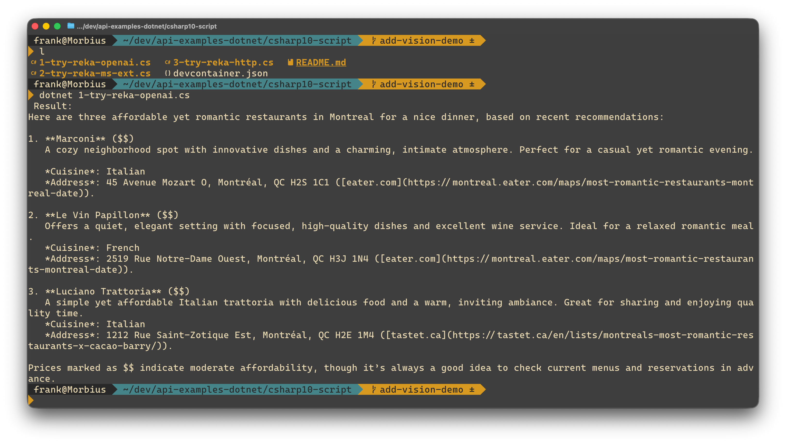
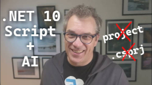

# C# Script demos with Reka Research API

Six examples that all do the same thing — find tech events — each using a different approach to call the [Reka API](https://docs.reka.ai/). Built as [.NET file-based apps](https://learn.microsoft.com/dotnet/core/whats-new/dotnet-10#file-based-apps): single `.cs` files, no `.csproj` needed.



## Setup

Requires [.NET 10](https://dotnet.microsoft.com/download).

> [!TIP]
> No .NET installed? Use the devContainer with [Docker](https://code.visualstudio.com/docs/devcontainers/tutorial) or [CodeSpace](https://docs.github.com/en/codespaces/quickstart).

1. Get a free API key from the [Reka Platform dashboard](https://link.reka.ai/free)
2. Copy `.env-sample` to `.env` and paste your key in place of *HERE_GOES_YOUR_API_KEY*

## Examples

| # | File | Approach |
| --- | ------ | ---------- |
| 1 | [1-try-reka-openai.cs](./1-try-reka-openai.cs) | OpenAI SDK basic call |
| 2 | [2-try-reka-ms-ext.cs](./2-try-reka-ms-ext.cs) | Microsoft Extension AI for OpenAI basic call |
| 3 | [3-try-reka-agent-fwk.cs](./3-try-reka-agent-fwk.cs) | Microsoft Agent Framework basic call |
| 4 | [4-try-reka-agent-fwk-structured.cs](./4-try-reka-agent-fwk-structured.cs) | Agent Framework with structured output |
| 5 | [5-try-reka-openai-advanced.cs](./5-try-reka-openai-advanced.cs) | OpenAI SDK with advanced web search beta and only with OpenAI APIs |
| 6 | [6-try-reka-http.cs](./6-try-reka-http.cs) | Raw HTTP — no SDK, just HttpClient but all features and all APIs |

Run any example with:

```bash
dotnet run <filename>
```

For example: `dotnet run 1-try-reka-openai.cs`

## Learn more

- [Reka API docs](https://docs.reka.ai/)
- [Discord community](https://discord.com/invite/MTRJEBvH)
- [Blog post: Using AI with .NET 10 Scripts](https://www.frankysnotes.com/2025/09/using-ai-with-net-10-scripts-what.html)
- [Video](https://www.youtube.com/watch?v=JwFHKQkah30)

  
