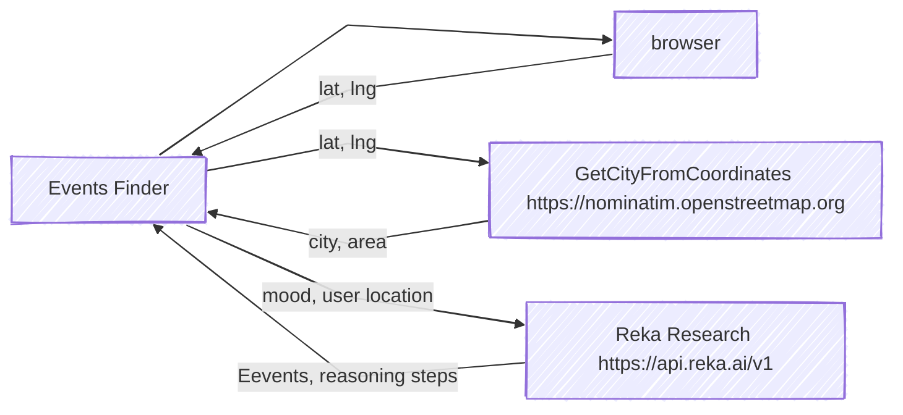

# Reka Tech Event Finder

This demo showcases how to use **Reka Research** to build intelligent apps that can search the web, structure responses, and support reasoning. It’s designed to help developers learn how to integrate and use [Reka Research](https://docs.reka.ai/research) and its advanced features to discover relevant tech events.


> Requirement:
>
> - Have .NET 9 installed or Docker or CodeSpace

If you don't have .NET install on you computer use the devContainer with [Docker](https://code.visualstudio.com/docs/devcontainers/tutorial) or [CodeSpace](https://docs.github.com/en/codespaces/quickstart) to create your workspace.

## 1. Get your API key

1) Go to the [Reka Platform dashboard](https://link.reka.ai/free)
2) Open the API Keys section on the left
3) Create a new key and copy it to your environment
4) Add the key into [appsettings.json)](appsettings.json) (or appsettings.Development.json).

Voilà! Your are all set!

## 2. Run the demo

1) Clone the repository:
   ```bash
   git clone https://github.com/reka-ai/api-examples-dotnet.git
   ```

2) Navigate to the project folder:
   ```bash
   cd api-examples-dotnet/event-finder
   ```

3) Run the project:
   ```bash
   dotnet run
   ```

## 3. Try it out

Once the application is running: 

- search for different topics (e.g., AI, .NET)
- Try to change the location (e.g., New York, Berlin), or only keep the country
- Only allow spefici domains (e.g., techcrunch.com)

For each research have a look to the reasoning steps and the final structured results.

## 4. Checkout the code

Open the project in your favorite IDE/ editor and you can look at [Services/RekaResearchService.cs](Services/RekaResearchService.cs) and change different parameters to see how it works.

## Diagram

Here is a diagram to illustrate where the information is coming from and going to during for initiate a Research.


And here is a sequence diagram to illustrate the flow of information:


## References

- [Docs: Reka Research API](https://docs.reka.ai/research)
- [Blog Post: How to Leverage Reka Research to Build Smarter AI Apps](https://reka.ai/news/how-to-leverage-reka-research-to-build-smarter-ai-apps)
- [Discord](https://link.reka.ai/discord)

