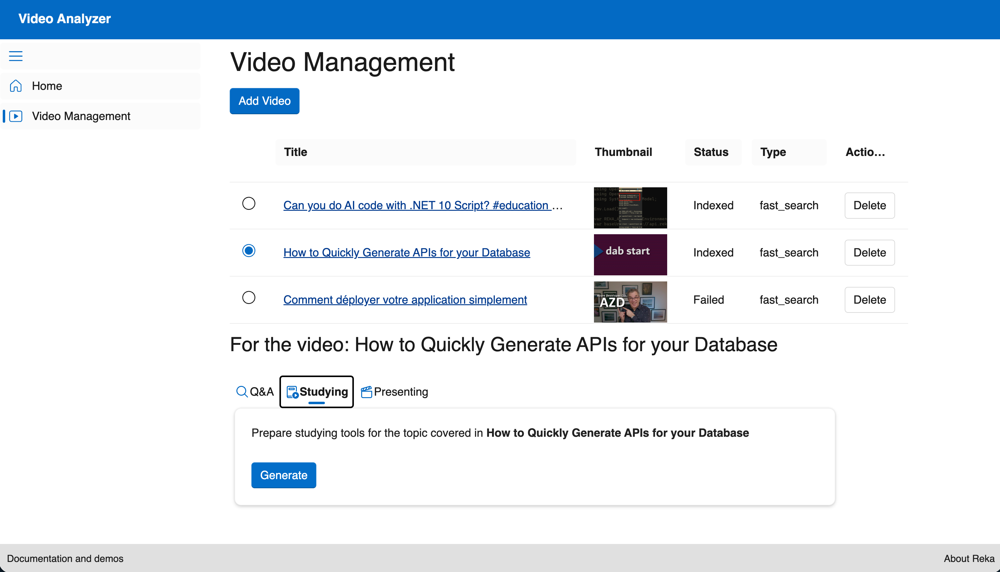

# Video Analyzer

A web application that leverages Reka AI Vision to provide powerful video analysis capabilities. This tool allows users to manage videos, perform semantic searches across video content, ask questions about specific videos, generate study materials, and evaluate presentation skills.

## Features

- **Video Management**: Upload, view, and delete videos with thumbnail previews and indexing status tracking
- **Semantic Search**: Search across all uploaded videos to find relevant content with timestamps
- **Q&A on Videos**: Ask questions about specific video content and get AI-powered answers
- **Study Material Generation**: Automatically generate summaries, multiple-choice questions, and study aids from video content
- **Presentation Evaluation**: Get feedback on presentation skills demonstrated in videos
- **Modern UI**: Built with Microsoft Fluent UI for a clean, accessible interface



## Prerequisites

- .NET 10.0 or Docker/Podman
- Reka AI API key (it's free! Get yours from [here from Reka](https://link.reka.ai/free))

## Running the Application

### Option 1: Using .NET CLI

1. Clone the repository:

   ```bash
   git clone https://github.com/reka-ai/api-examples-dotnet
   cd video-analyzer/src
   ```

2. Set up environment variables:
   Create a `.env` file in the root directory with your Reka API key:

   ```env
   REKA_API_KEY=your_api_key_here
   ```

3. Navigate to the src directory and run the application:

   ```bash
   dotnet run
   ```

4. Open your browser and navigate to `http://localhost:5291`

### Option 2: Using Docker/Podman

1. Clone the repository:

   ```bash
   git clone https://github.com/reka-ai/api-examples-dotnet
   cd video-analyzer
   ```

2. Set up environment variables:
   Create a `.env` file in the root directory with your Reka API key:

   ```env
   REKA_API_KEY=your_api_key_here
   ```

3. Run with Docker Compose:

   ```bash
   docker-compose up
   ```

   Or with Podman:

   ```bash
   podman-compose up
   ```

4. Open your browser and navigate to `http://localhost:8080`

## Contributing

We welcome contributions! Please feel free to submit a Pull Request. For major changes, please open an issue first to discuss what you would like to change.

## License

This project is licensed under the MIT License.
